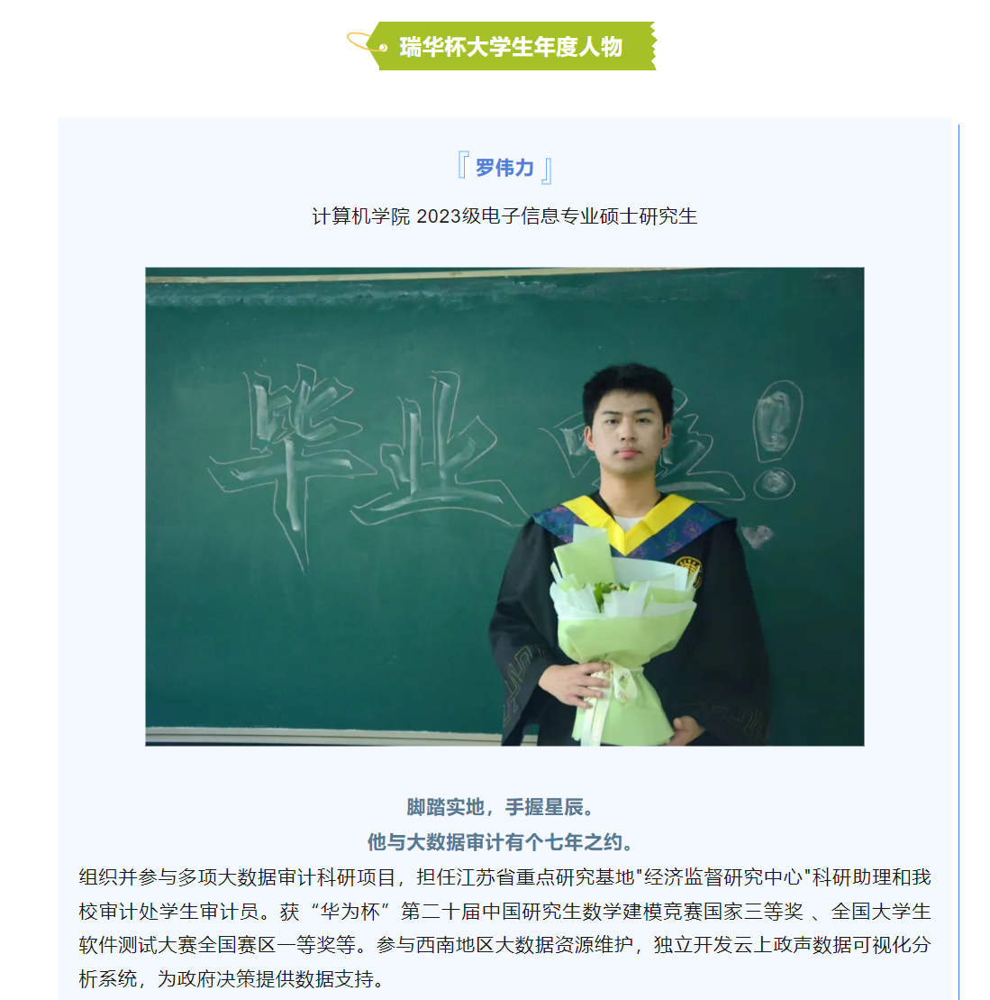
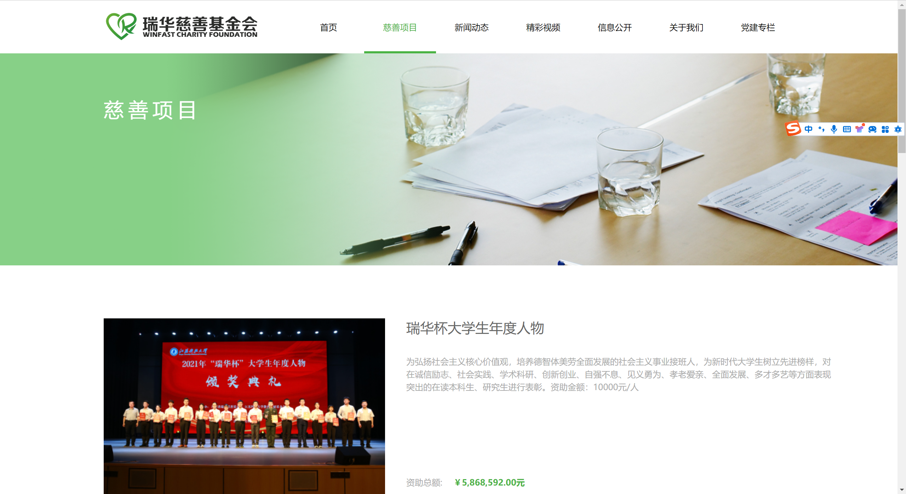
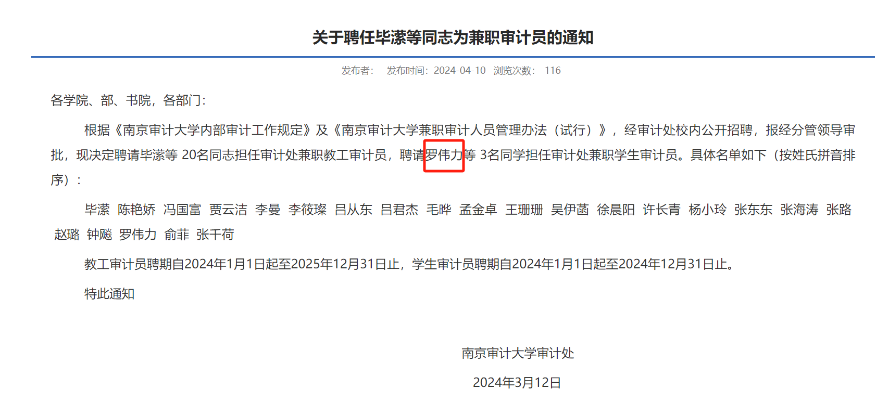
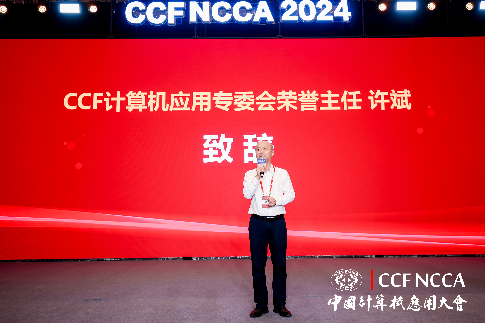
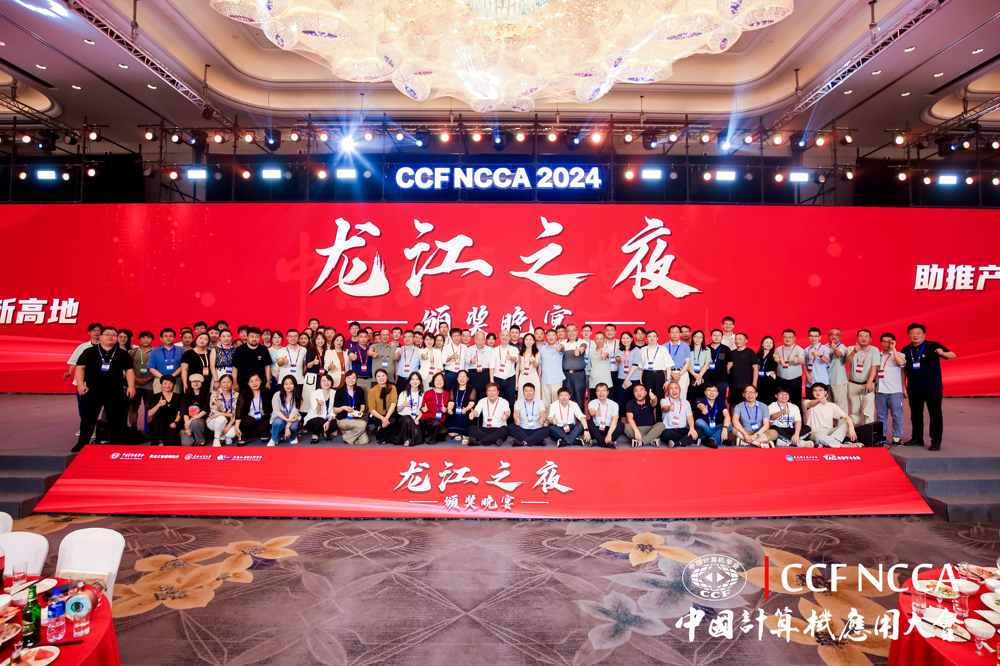

2023:

1. **[2023年11月“华为杯”第二十届中国研究生数学建模竞赛国家三等奖(C题前25%)](https://cpipc.acge.org.cn//cw/detail/4/2c9080158aee323f018c0b4b1fdf71ff)**

2. **[2023年11月全国大学生软件测试大赛 Web 应用个人赛国家三等奖第二名](http://www.mooctest.org/#/home/news?id=127)**

3. **2023年11月全国大学生软件测试大赛全国赛区一等奖**

4. **2023年11月全国大学生软件测试大赛江苏赛区一等奖**

5. **2023年12月“领航杯”江苏省大学生信息技术应用能力赛三等奖**

6. **2023年9月学业三等奖学金**

2024：

1. **2024年3月"瑞华杯"年度大学生人物暨最美大学生(研究生组第一)**
1. **2024年3月担任江苏省重点研究基地"经济监督研究中心"科研助理**
1. **2024年4月担任南京审计大学审计处学生审计员**
1. **2024年5月第十五届蓝桥杯软件大赛江苏赛区软件测试组一等奖**
1. **[2024年6月第十五届蓝桥杯软件大赛软件测试组全国总决赛国家二等奖第二名](https://dasai.lanqiao.cn/notices/1636)**
1. **2024年6月CCF全国测试开发大赛江苏赛区二等奖**
1. **2024年7月第39届CCF CAT全国测试开发大赛全国一等奖**

公众号/官网报道：

1. [2024年3月12号教务系统公众号报道一次](https://mp.weixin.qq.com/s/hKrirpjQrYH_IcoT9nYnrA?poc_token=HKKCN2ajewIMrXKk-2kkCQrITvWFEGef1rD6m673)
2. [2024年3月14号学生工作处第一次](https://xgc.nau.edu.cn/2024/0314/c3439a126090/page.htm)
3. [2024年3月18号学生工作处第二次](https://xgc.nau.edu.cn/2024/0318/c3439a126323/page.htm)
4. [2024年3月25号联合研究院官网第2期工作例会](https://jri.nau.edu.cn/2024/0325/c10286a126700/page.htm)
5. [2024年4月7号计算机学院公众号报道一次](https://mp.weixin.qq.com/s/101BBOmEMiIHJfr95c1fkQ)
6. [2024年4月10号审计处官网聘任通知](https://sjc.nau.edu.cn/2024/0410/c3418a127887/page.htm)
7. [2024年4月10号审计处官网审计员座谈会](https://sjc.nau.edu.cn/2024/0410/c3423a127883/page.htm)
8. [2024年5月4号南京审计大学官方公众号报道一次](https://mp.weixin.qq.com/s/yCAIPZt7EIwk5mvwLXItxg)

其他：

1. **同济大学“苗圃计划”优秀学员&结业证书**
1. **校级优秀大创《基于机器学习的多因子选股策略实证研究及模型适应性分析》第一主持人**
1. **英语六级证书**

补充：

1. "华为杯"：华为技术有限公司，成立于1987年，总部位于[广东省](https://baike.baidu.com/item/广东省/132473?fromModule=lemma_inlink)[深圳市](https://baike.baidu.com/item/深圳市/11044365?fromModule=lemma_inlink)[龙岗区](https://baike.baidu.com/item/龙岗区/4165824?fromModule=lemma_inlink)。 [1]被授予“泰国总理特别奖”。 [434]华为是全球领先的[信息与通信技术](https://baike.baidu.com/item/信息与通信技术/18492416?fromModule=lemma_inlink)（ICT）解决方案供应商，专注于[ICT](https://baike.baidu.com/item/ICT/32270?fromModule=lemma_inlink)领域，坚持稳健经营、持续创新、开放合作，在[电信运营商](https://baike.baidu.com/item/电信运营商/10694548?fromModule=lemma_inlink)、[企业](https://baike.baidu.com/item/企业/707680?fromModule=lemma_inlink)、[终端](https://baike.baidu.com/item/终端/15634871?fromModule=lemma_inlink)和[云计算](https://baike.baidu.com/item/云计算/9969353?fromModule=lemma_inlink)等领域构筑了端到端的解决方案优势，为[运营商](https://baike.baidu.com/item/运营商/4530550?fromModule=lemma_inlink)客户、企业客户和消费者提供有竞争力的ICT解决方案、产品和服务，并致力于实现未来信息社会、构建更美好的全连接世界。

2. 大学生软件测试大赛主办单位：
   1. 全国大学生软件测试大赛组委会
   2. 中国计算机学会软件工程专业组委会
   3. 中国计算机学会系统软件专业组委会
   4. 中国计算机学会容错计算专业组委会

3. "领航杯"：江苏省教育厅主办的，进一步引导大学生积极提升信息素养和创新意识，不断增强“互联网+”时代大学生创新创业能力，努力为培养高素质人才、服务经济社会高质量发展作出新的更大贡献。

4. "瑞华杯"：江苏瑞华投资控股集团有限公司创立于2003年，总部位于南京市玄武区徐庄软件园，拥有占地面积33亩的瑞华投创园，并在香港、广州和深圳设有分公司，管理资产规模超百亿元人民币，主营业务包括证券流通市场投资、直接股权投资(PE、VC)、上市公司定向增发(PIPE)投资以及金融期货与衍生品投资等，对中国资本市场形成完整覆盖。自成立以来，公司累计认购定增项目超460个，累计投资金额超790亿元，参与股权PE项目超140个，存量投资规模约60亿元，直接或间接持有的数十家企业已成功上市。重点投资新能源、生物医药、大健康等国家支持的产业，通过向优质企业输送资金，服务实体经济，赋能产业发展。原文链接](https://mp.weixin.qq.com/s/yCAIPZt7EIwk5mvwLXItxg)。[关于瑞华杯大学生年度人物](https://www.jsrh-foundation.org.cn/project/detail/PRO20211018144806097029)

5. 学生审计员：围绕大数据环境下审计实务需求，服务于国家审计监督与治理能力现代化，为各类企事业单位、金融机构和政府部门提供面向审计的大数据分析与处理、大数据开发与应用、大数据系统集成与管理维护以及大数据审计的复合型服务 [官网报道](https://sjc.nau.edu.cn/2024/0410/c3418a127887/page.htm)

6. 江苏省重点研究基地经济监督研究中心：[联合研究院召开经济监督研究中心 2024年第2期工作例会](https://jri.nau.edu.cn/2024/0325/c10286a126700/page.htm) 

7. CCF CAT：中国计算机学会（CCF）主办，CCF 计算机应用专业委员会、中国计算机应用技术大赛组委会承办的中国计算机应用技术大赛。中国计算机应用大会是CCF的重要学术交流会议之一，大会连续多年被评为中国科学技术协会重要学术会议指南推荐会议之一。此次大会邀请了10余位中国科学院院士、中国工程院院士及50余位计算领域及其行业应用领域的国家级人才、顶级专家学者、企业家，共同探讨人工智能＋应用。测试开发大赛主要从企业用人需求角度考察编程能力、算法和数据结构、设计模式、业务分析与测试能力、自动化测试能力、软件测试工程实践和规范等。

   